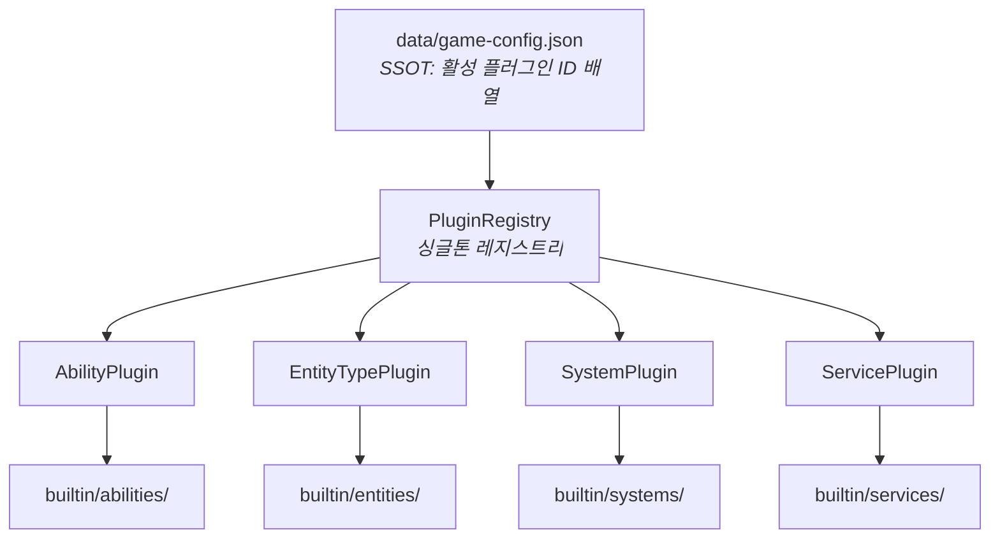
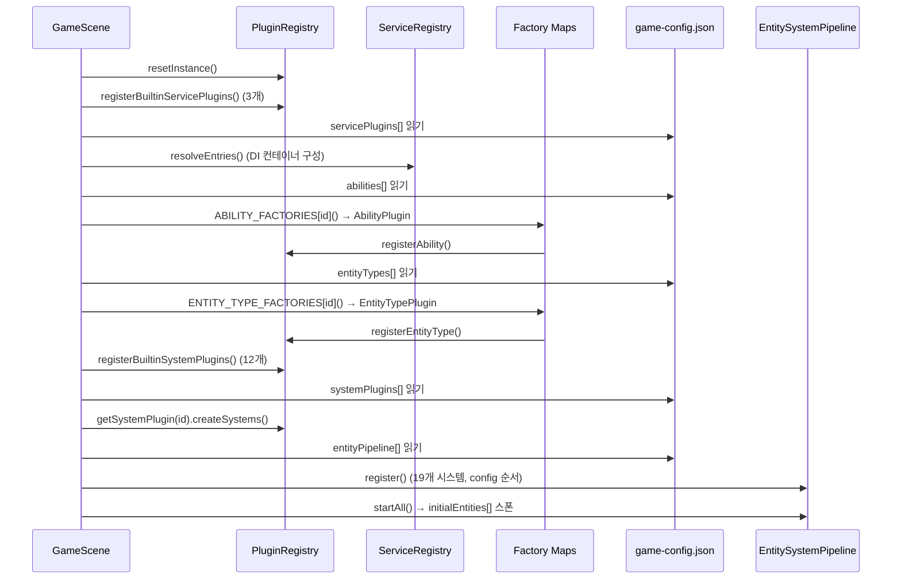
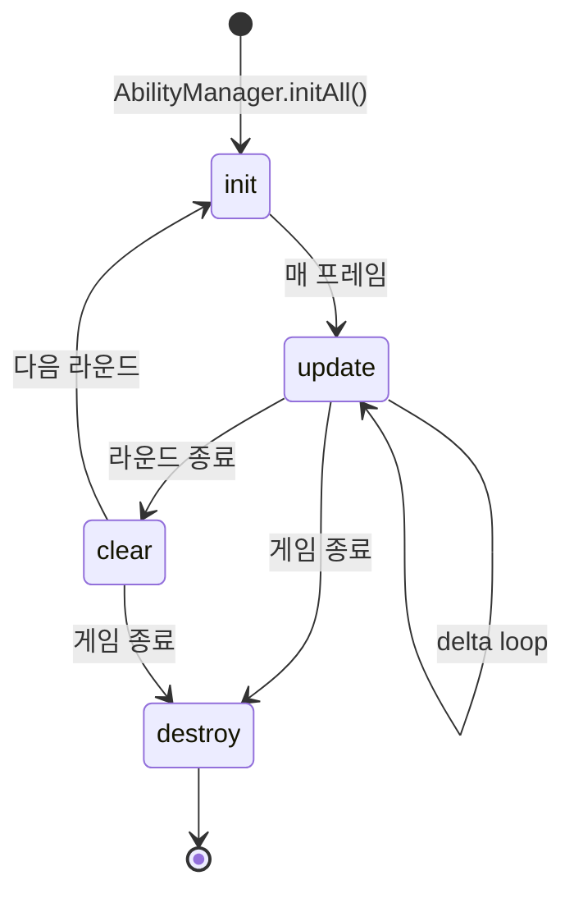
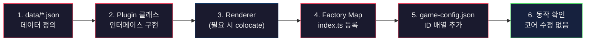
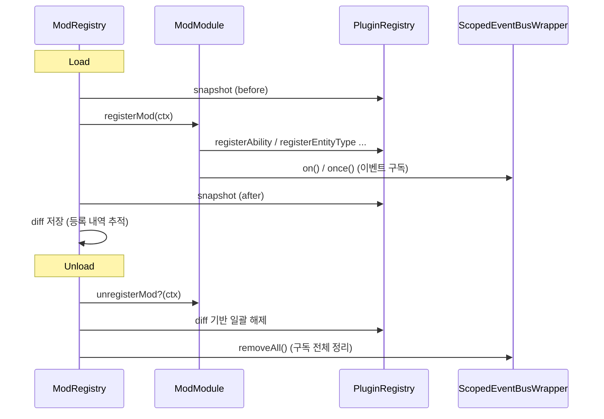

# 플러그인 아키텍처 가이드

> **핵심 원칙**: 모든 콘텐츠(엔티티, 어빌리티, 시스템, 서비스)는 플러그인 추가만으로 동작해야 한다.
> 코어 코드(Scene, Pipeline, Registry)를 수정하지 않고 `game-config.json` + 플러그인 클래스 + 팩토리 맵 등록으로 완결한다.

---

## 1. 아키텍처 개요



### 등록 흐름 (GameScene.initializeSystems)



---

## 2. 플러그인 타입별 인터페이스

### 2.1 AbilityPlugin

패시브/액티브 어빌리티를 구현한다. 정의: `src/plugins/types/AbilityPlugin.ts`

```typescript
interface AbilityPlugin {
  readonly id: string;
  init(ctx: AbilityContext): void;        // 초기화 (scene, upgradeSystem, getCursor)
  update(delta, gameTime, playerX, playerY): void;  // 매 프레임 로직
  clear(): void;                          // 라운드 종료 정리
  destroy(): void;                        // 완전 파괴
  createRenderer(scene): AbilityRenderer | null;    // 전용 렌더러 (없으면 null)
  getEffectValue(key: string): number;              // 외부에서 효과값 조회
  getDerivedStats?(currentLevel, nextLevel): DerivedStatEntry[]; // 업그레이드 프리뷰
}
```

**라이프사이클**:



**렌더러**: `AbilityRenderer` 인터페이스 (`update`/`render`/`destroy`) 구현. 플러그인 파일과 같은 디렉토리에 colocate.

**예시**: `CursorSizeAbility` (패시브, 렌더러 없음) / `OrbAbility` (액티브, `OrbRenderer` colocate)

### 2.2 EntityTypePlugin

접시/보스/폭탄/플레이어 등 엔티티 타입을 정의한다. 정의: `src/plugins/types/EntityTypePlugin.ts`

```typescript
interface EntityTypePlugin {
  readonly typeId: string;
  readonly config: EntityTypeConfig;      // spawnCategory, poolSize, lifetime, cursorInteraction, archetypeId

  createRenderer(scene, host): EntityTypeRenderer;              // 필수: 전용 렌더러
  createMovementData?(entityId, homeX, homeY): MovementComponent; // 이동 데이터
  createAttackPatterns?(scene, entityId): AttackPattern[];      // 공격 패턴

  spawn?(world): EntityId;               // singleton 전용 스폰
  onSpawn?(entityId, world): void;
  onUpdate?(entityId, world, delta, gameTime): void;
  onDamaged?(entityId, world, damage, source): void;
  onDestroyed?(entityId, world): void;
  onTimeout?(entityId, world): void;
}
```

**카테고리**:
- `pooled` — ObjectPool에서 재사용 (접시, 폭탄, 보스)
- `singleton` — 단일 인스턴스 (플레이어)

**EntityTypeConfig 필드**:
| 필드 | 타입 | 설명 |
|------|------|------|
| `spawnCategory` | `'pooled' \| 'singleton'` | 풀링 방식 |
| `poolSize` | `number` | 풀 크기 (singleton은 0) |
| `defaultLifetime` | `number \| null` | 기본 수명 ms (null = 무한) |
| `isGatekeeper` | `boolean` | 웨이브 완료 게이트키퍼 여부 |
| `cursorInteraction` | `'dps' \| 'contact' \| 'explode' \| 'none'` | 커서 상호작용 방식 |
| `archetypeId` | `string?` | World 아키타입 ID |

### 2.3 SystemPlugin

EntitySystem 배열을 생성하는 팩토리. 정의: `src/plugins/types/SystemPlugin.ts`

```typescript
interface SystemPlugin {
  readonly id: string;
  createSystems(ctx: SystemPluginContext): EntitySystem[];  // { scene, world, services }
  destroy?(): void;
}
```

`createSystems()`가 반환한 각 `EntitySystem`은 `game-config.json`의 `entityPipeline` 순서대로 파이프라인에 등록된다.

### 2.4 ServicePlugin

DI 컨테이너에 서비스를 선언적으로 등록한다.

```typescript
interface ServicePlugin {
  readonly id: string;
  readonly services: ServiceEntry[];  // Class constructor 또는 { key, factory } 튜플
}
```

---

## 3. 새 콘텐츠 추가 절차

> 아래 흐름도는 모든 플러그인 타입에 공통으로 적용되는 추가 패턴이다.



### 3.1 새 어빌리티 추가

1. **데이터**: `data/upgrades.json`에 어빌리티 레벨 데이터 추가
2. **플러그인 클래스**: `src/plugins/builtin/abilities/NewAbility.ts` 작성 (`AbilityPlugin` 구현)
3. **렌더러** (필요 시): 같은 디렉토리에 `NewAbilityRenderer.ts` 작성
4. **팩토리 맵 등록**: `src/plugins/builtin/abilities/index.ts`의 `ABILITY_FACTORIES`에 한 줄 추가
5. **활성화**: `data/game-config.json`의 `abilities` 배열에 ID 추가
6. **시스템** (필요 시): 전용 EntitySystem이 필요하면 SystemPlugin도 추가 (3.3 참조)

```typescript
// abilities/index.ts — 팩토리 맵에 한 줄 추가
const ABILITY_FACTORIES: Record<string, () => AbilityPlugin> = {
  // ... 기존 항목
  new_ability: () => new NewAbility(),
};
```

### 3.2 새 엔티티 타입 추가

1. **데이터**: `data/entities.json`에 타입 정의 추가
2. **아키타입** (필요 시): `data/entities.json`의 `archetypes` 섹션에 아키타입 추가 (컴포넌트 이름 문자열 배열)
3. **플러그인 클래스**: `src/plugins/builtin/entities/NewEntity.ts` 작성 (`EntityTypePlugin` 구현)
4. **렌더러**: 같은 디렉토리에 `NewEntityRenderer.ts` 작성
5. **팩토리 맵 등록**: `src/plugins/builtin/entities/index.ts`의 `ENTITY_TYPE_FACTORIES`에 한 줄 추가
6. **활성화**: `data/game-config.json`의 `entityTypes` 배열에 ID 추가

```typescript
// entities/index.ts — 팩토리 맵에 한 줄 추가
const ENTITY_TYPE_FACTORIES: Record<string, () => EntityTypePlugin> = {
  // ... 기존 항목
  new_entity: () => new NewEntityPlugin(),
};
```

### 3.3 새 시스템 추가

1. **EntitySystem 구현**: 플러그인 구체 렌더러/엔티티에 의존하면 `src/plugins/builtin/systems/NewSystem.ts`, 코어만 참조하면 `src/systems/entity-systems/NewSystem.ts` 작성
2. **SystemPlugin 래퍼**: `src/plugins/builtin/systems/NewSystemPlugin.ts` 작성
3. **등록**: `src/plugins/builtin/systems/index.ts`의 `registerBuiltinSystemPlugins()`에 추가
4. **활성화**: `data/game-config.json`의 `systemPlugins` 배열에 ID 추가
5. **파이프라인 순서**: `data/game-config.json`의 `entityPipeline` 배열에 시스템 ID 추가 (실행 순서 위치 결정)

### 3.4 새 서비스 추가

1. **서비스 클래스**: 콘텐츠 서비스는 `src/plugins/builtin/services/`, 코어 인프라는 `src/systems/`에 작성
2. **ServicePlugin에 등록**: 기존 `CoreServicesPlugin`/`EcsFoundationPlugin`/`GameModulesPlugin` 중 적절한 곳의 `services` 배열에 추가. 필요 시 새 ServicePlugin 작성.

---

## 4. 디렉토리 구조 및 colocate 규칙

> 파일별 역할/API 상세는 `docs/CODEMAP.md` §2.6 "플러그인 아키텍처"를 참조한다. 이 섹션은 **배치 규칙**만 정의한다.

**colocate 규칙**:
- 엔티티/어빌리티 전용 렌더러는 해당 플러그인과 같은 디렉토리에 배치한다. 범용 이펙트(`ParticleManager`, `GridRenderer`, `StarBackground`)만 `src/effects/`에 위치한다.
- 플러그인 구체 구현(렌더러/엔티티)에 직접 의존하는 EntitySystem은 `src/plugins/builtin/systems/`에 colocate한다. 코어(`src/systems/entity-systems/`)에는 플러그인 구체 타입을 참조하지 않는 시스템만 위치한다.

| 분류 | 위치 | 팩토리 맵 진입점 |
|------|------|-----------------|
| 어빌리티 플러그인 + 렌더러 | `src/plugins/builtin/abilities/` | `ABILITY_FACTORIES` (`index.ts`) |
| 엔티티 타입 플러그인 + 렌더러 | `src/plugins/builtin/entities/` | `ENTITY_TYPE_FACTORIES` (`index.ts`) |
| 시스템 플러그인 | `src/plugins/builtin/systems/` | `registerBuiltinSystemPlugins()` (`index.ts`) |
| 서비스 플러그인 + 콘텐츠 서비스 | `src/plugins/builtin/services/` (+ `wave/`, `upgrades/`, `boss/`, `dish/`) | `registerBuiltinServicePlugins()` (`index.ts`) |
| 인터페이스 정의 | `src/plugins/types/` | — |
| 코어 레지스트리/MOD 인프라 | `src/plugins/` (root) | — |

---

## 5. game-config.json SSOT 필드

| 필드 | 역할 | 예시 |
|------|------|------|
| `servicePlugins` | 활성 ServicePlugin ID | `["core:services", "core:ecs", "core:game_modules"]` |
| `systemPlugins` | 활성 SystemPlugin ID | `["core:initial_spawn", "core:world_systems", ...]` |
| `entityTypes` | 활성 EntityType ID | `["player", "basic", "golden", ..., "boss_standard"]` |
| `abilities` | 활성 Ability ID | `["cursor_size", "critical_chance", ...]` |
| `entityPipeline` | 시스템 실행 순서 (19개) | `["core:initial_spawn", "core:wave", ...]` |
| `initialEntities` | 게임 시작 시 스폰할 엔티티 | `["player"]` |

**추가/제거는 이 배열만 수정하면 된다.** 코어 코드 변경 불필요.

---

## 6. MOD 확장 (외부 플러그인)

MOD는 빌트인 플러그인과 동일한 인터페이스를 사용하되, `ModModule` 진입점을 통해 등록한다.

```typescript
interface ModModule {
  readonly id: string;
  readonly version?: string;
  registerMod(ctx: ModContext): void;     // 등록
  unregisterMod?(ctx: ModContext): void;  // 해제 (optional)
}
```

**ModContext 제공 항목**: `pluginRegistry`, `modSystemRegistry`, `entitySystemPipeline`, `statusEffectManager`, `events` (ScopedEventBus), `world`, `archetypeRegistry`

**MOD 로드/언로드 안전 장치**:



---

## 7. 콘텐츠 이벤트 바인딩 패턴

콘텐츠 관련 이벤트(DISH/BOMB/BOSS/PLAYER_ATTACK)는 코어가 아닌 플러그인 레이어에서 라우팅한다.

### 코어/플러그인 경계 원칙

- **코어(`GameSceneEventBinder`)**: 코어 UI(WaveCountdownUI/HUD), 코어 시스템(HealthSystem.reset), Scene 라이프사이클(WAVE_COMPLETED/UPGRADE_SELECTED/GAME_OVER) 이벤트만 라우팅.
- **플러그인(`ContentEventBinder`)**: 보스/디쉬/폭탄/플레이어 공격 + 콘텐츠 피드백(COMBO_MILESTONE/MONSTER_DIED/HEALTH_PACK/CURSE_HP_PENALTY/HP_CHANGED피드백/BLACK_HOLE_CONSUMED) 이벤트를 콘텐츠 서비스(BCC/DLC/PAC/FeedbackSystem/MonsterSystem/WaveSystem/UpgradeSystem)로 라우팅.
- **`WAVE_TRANSITION` 이벤트**: 코어(`GameSceneController`)가 emit → 플러그인(`ContentEventBinder`)이 구독하여 BCC/DLC를 정리. 코어가 콘텐츠 서비스를 직접 호출하지 않는다.

### ContentEventBinder 등록

`GameModulesPlugin`의 마지막 서비스 엔트리로 등록. `bind()` 호출로 이벤트 구독 시작, `destroy()` 호출로 구독 해제.

```typescript
// GameModulesPlugin.ts
{ key: ContentEventBinder, factory: (r) => { const b = new ContentEventBinder(r); b.bind(); return b; } }
```

### 콘텐츠 서비스 위치

모든 콘텐츠 레벨 서비스는 `src/plugins/builtin/services/`에 위치:
- `WaveSystem.ts` + `wave/` (WaveConfigResolver, WavePhaseController, WaveSpawnPlanner)
- `ComboSystem.ts`, `GaugeSystem.ts`, `ScoreSystem.ts`, `MonsterSystem.ts`
- `UpgradeSystem.ts` + `upgrades/` (UpgradeDescriptionFormatter, UpgradePreviewModelBuilder)
- `SoundSystem.ts`, `FeedbackSystem.ts`
- `EntityDamageService.ts`, `DishDamageResolver.ts`, `DishEventPayloadFactory.ts`, `waveBossConfig.ts`
- `BossCombatCoordinator.ts` + `boss/` (BossRosterSync, BossLaserController, BossAttackScheduler 등)
- `DishLifecycleController.ts` + `dish/` (DishSpawnService, DishResolutionService)
- `PlayerAttackController.ts`
- `ContentContracts.ts` (보스/디쉬 이벤트 payload 타입)

---

## 8. 금지 사항

> 코어 수정 금지, Scene 직접 호출 금지 등 상위 원칙은 `AGENTS.md` 원칙 3(플러그인 우선)·13(ECS 파이프라인)을 따른다. 아래는 플러그인 작업에 특화된 추가 금지 사항이다.

- **팩토리 맵 우회 금지**: `PluginRegistry`에 직접 등록하지 않는다. 팩토리 맵(`ABILITY_FACTORIES`, `ENTITY_TYPE_FACTORIES`) + `game-config.json` ID 배열 패턴을 따른다.
- **렌더러 분산 금지**: 전용 렌더러를 `src/effects/`에 배치하지 않는다. 플러그인 디렉토리에 colocate한다.

---

## 9. 체크리스트: 새 플러그인 추가 시

- [ ] 플러그인 인터페이스(`AbilityPlugin`/`EntityTypePlugin`/`SystemPlugin`/`ServicePlugin`)를 정확히 구현했는가
- [ ] 밸런스/연출 데이터를 `data/*.json`에 먼저 정의했는가
- [ ] 팩토리 맵(`index.ts`)에 등록했는가
- [ ] `data/game-config.json`의 해당 배열에 ID를 추가했는가
- [ ] 전용 렌더러를 플러그인과 같은 디렉토리에 colocate했는가
- [ ] 시스템이 `entityPipeline` 배열에 올바른 순서로 배치되었는가
- [ ] 코어 코드(Scene/Pipeline/Registry)를 수정하지 않았는가
